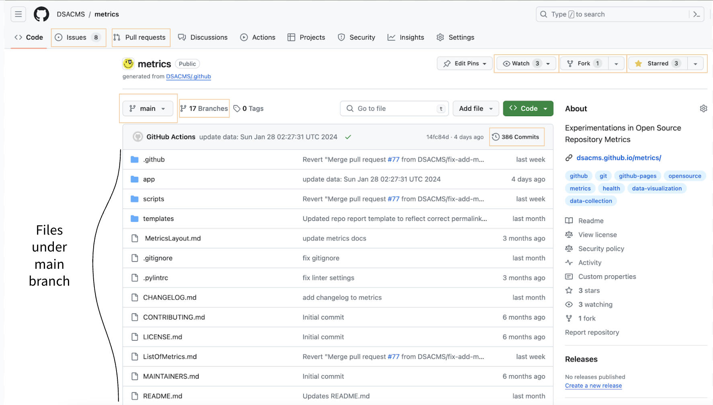

# GitHub Glossary

## Git Terminology
*Taken from [GitHub Docs](https://docs.github.com/en/get-started/quickstart/github-glossary)*

###  Repository 
*Also known as “repo”*
A repository is the most basic element of GitHub. They're easiest to imagine as a
project's folder. A repository contains all of the project files (including documentation),
and stores each file's revision history. Repositories can have multiple collaborators and can be either public or private.

###  Branch
A parallel version of a repository. It is contained within the repository, but does not affect the primary or main branch allowing you to work freely without disrupting the "live" version. When you've made the changes you want to make, you can merge your branch back into the main branch to publish your changes.

### Main Branch
The primary branch of all repositories. All committed and accepted changes should be on the master branch. You can work directly from the master branch, or create other branches.

###  Commit
An individual change to a file (or set of files). When you make a commit to save your work, Git keeps a record of the specific changes committed along with who made them and when. Commits usually contain a commit message which is a brief description of what changes were made.

###  Pull Request
*Also known as “PR”*
Proposed changes to a repository submitted by a user and accepted or rejected by a repository's collaborators.

### Pull Request Review
Comments from collaborators on a pull request that approve the changes or request further changes before the pull request is merged.

###  Issue
Suggested improvements, tasks or questions related to the repository. Issues can be created by anyone (for public repositories), and are moderated by repository collaborators. Each issue contains its own discussion thread. You can also categorize an issue with labels and assign it to someone.

###  Fork
A personal copy of another user's repository that lives on your account. Forks allow you to freely make changes to a project without affecting the original upstream repository. You can also open a pull request in the upstream repository and keep your fork synced with the latest changes since both repositories are still connected.

###  Star
A bookmark or display of appreciation for a repository. Stars are a manual way to rank the popularity of projects.

### GitHub Repository Page

## GitHub Workflow: Making Changes to your Repository
*Taken from [GitHub Docs](https://docs.github.com/en/get-started/quickstart/hello-world)*

1. [Create a new branch](https://docs.github.com/en/get-started/start-your-journey/hello-world#creating-a-branch)
- The main branch serves as the primary branch for new pull requests and code commits.
- Everytime you’d like to make changes to your repository, create a new branch which is a copy from the main branch.

2. [Make your edits in the newly-created branch](https://docs.github.com/en/get-started/start-your-journey/hello-world#making-and-committing-changes)
- All your edits will be made under this new branch.
- Saved changes are called commits. 
- When you create a commit, write a commit message, which is a description explaining why a particular change was made.

3. [Open a Pull Request](https://docs.github.com/en/get-started/start-your-journey/hello-world#opening-a-pull-request)
- When you open a pull request, you're proposing your changes and requesting that someone review and pull in your contribution and merge them into the main branch. 
- Pull requests show differences of the content from both branches. The changes, additions, and subtractions are shown in different colors.
- Reviewers start discussions on the proposed changes by commenting on the pull request. After a full review, they can either approve your pull request to merge or request for any edits.

4. [Merge the Pull Request](https://docs.github.com/en/get-started/start-your-journey/hello-world#merging-your-pull-request)
- Once your pull request has been reviewed and approved, merge in your pull request, resulting in your changes on your branch being incorporated into the main branch.

# CMS-Specific GitHub Resources

Instructions on accessing CMS Cloud GitHubs (CMSGov & OIT-Enterprise):
https://cloud.cms.gov/accessing-cms-cloud-github

Instructions on managing CMS Cloud GitHub repositories. Find guidance on creating repositories, configuring repositories, making pull requests to repositories:
https://cloud.cms.gov/managing-cms-cloud-github-repositories 

List of Repositories on CMS Cloud Github:
https://cloud.cms.gov/cms-cloud-github-repository-list